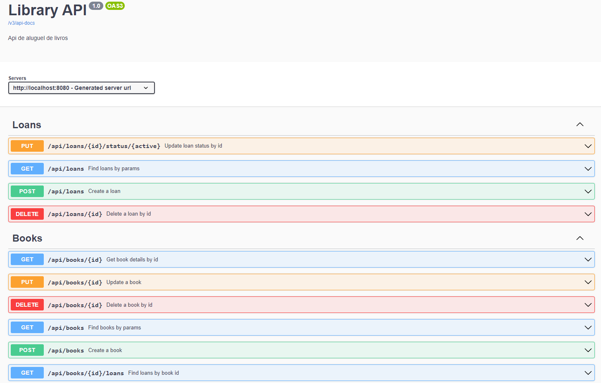

# Americanas - Estágio Tech - Spring

## :computer: Projeto

O Projeto é uma API de aluguel de livros.

<p align="center">
    
</p>

## :books: Tecnologias

Este projeto foi desenvolvido com:

-   [Spring Boot](https://spring.io/projects/spring-boot)
-   [Spring Data JDBC](https://spring.io/projects/spring-data-jdbc)
-   [Lombok](https://projectlombok.org/)
-   [H2 Database](https://www.h2database.com/html/main.html)
-   [JaCoCo](https://www.jacoco.org/jacoco/)
-   [Swagger](https://springdoc.org/)

## :rocket: Iniciar a aplicacão

### Pré-requisitos

-   [Java JDK 17](https://www.oracle.com/java/technologies/javase/jdk17-archive-downloads.html)

---

1. Clone o repositório.

```console
git clone https://github.com/dhiegogoncalves/americanas-estagiotech-spring.git
cd americanas-estagiotech-spring
```

2. Caso queria mudar as configurações da database, acesse o arquivo `src/main/resources/application.properties`.

```console
spring.datasource.url=jdbc:h2:mem:library;DATABASE_TO_LOWER=TRUE
spring.datasource.username=root
spring.datasource.password=123456
```

3. Execute o comando abaixo para iniciar o projeto.

```console
./mvnw spring-boot:run
```

Em seguida, acesse o link [http://localhost:8080/swagger-ui/index.html](http://localhost:8080/swagger-ui/index.html). <br />
Para acessar a database, acesse o link [http://localhost:8080/h2-console](http://localhost:8080/h2-console).
